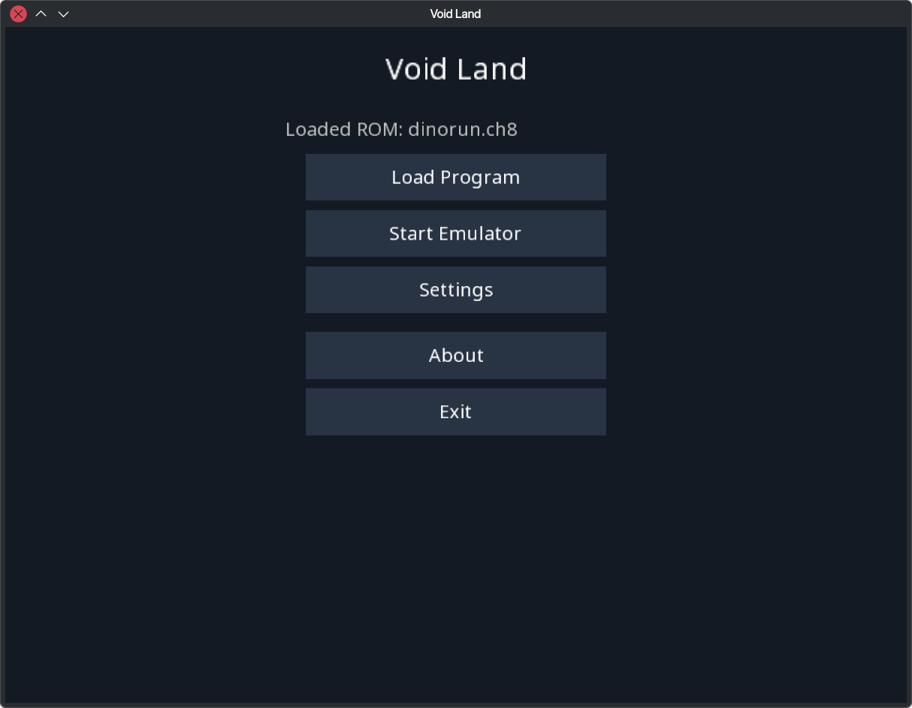
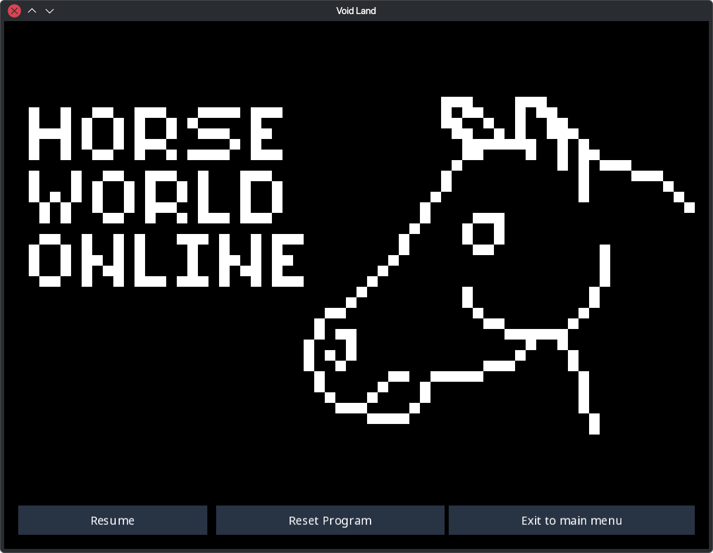
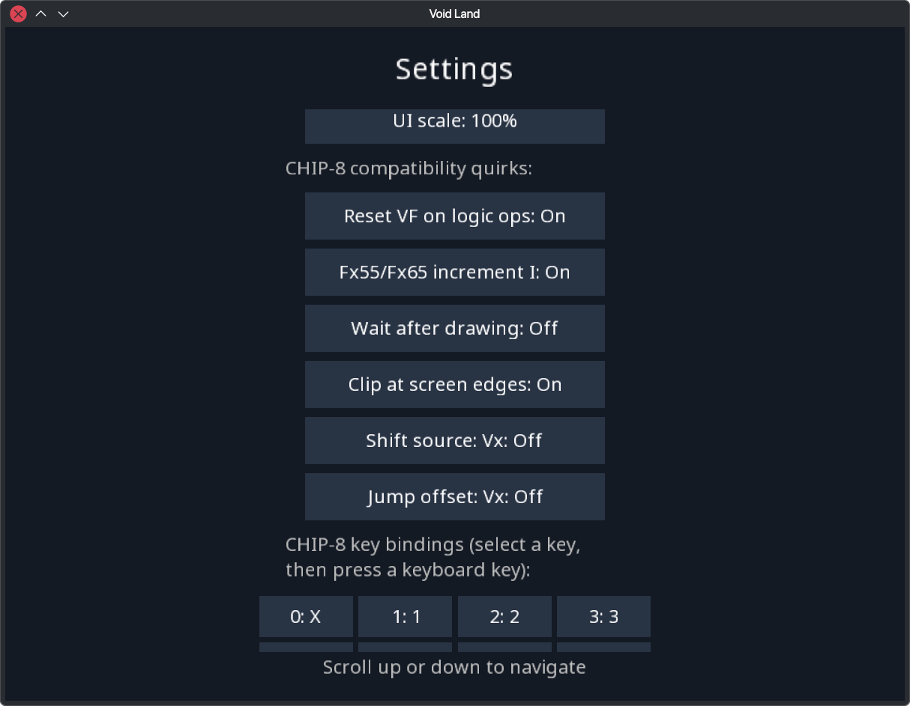

# Void Land

A CHIP-8 emulator built with [libGDX](https://libgdx.com/).

## Screenshots

## Run

Run the desktop app with `./gradlew lwjgl3:run` (Windows: `gradlew.bat lwjgl3:run`).

Settings are saved to `settings.json` in the app's working directory. The Settings menu lets you configure key bindings and CHIP-8 compatibility quirks.
